# Grade 12 IB Math AA SL — Test Bank

<!--
NOTES FOR WHOEVER BUILDS THE SITE (e.g. Claude Code)

Source: past chapter tests (2015–2026) for Grade 12 — Review + Limits, and Derivatives / Applications — transcribed from phone photos and scans of marked student scripts, plus a few PDFs.
Same format as the Grade 11 test bank (`Gr11-test-bank`), so one site template can serve both.

Structure
- `##`  = chapter group (2 groups)
- `###` = one paper (a test from a given school year)
- `####` = one question ("Question N"), numbered as on the original paper
- Parts are paragraphs starting (a), (b)…; sub-parts i., ii. …
- Italic lines directly under a `###` are paper metadata (total marks, calculator rules, and notes on missing/unclear pages).
- Some papers are incomplete in the scan (missing questions or missing final pages); the metadata line says which. Question numbers are kept as printed, so gaps are expected.

Math
- LaTeX, inline `$...$` only (no `$$` blocks). Piecewise definitions use `$\displaystyle\begin{cases}...\end{cases}$`.
  Render with KaTeX or MathJax (needs `\dfrac`, `\tfrac`, `\mathbb`, `\circ`, `\binom`, `\begin{cases}`).
- Protect `$...$` from the Markdown parser before parsing (underscores and backslashes inside math).

Marks
- `**[n]**` = mark allocation for the part/question it follows.

Figures
- Each figure is one or two Markdown images followed by an italic caption line starting `*Figure (<id>): ...*`.
- `figures/<id>.svg` = clean redraw. SVGs carry their own <style> using CSS variables with fallbacks
  (--fg, --muted, --accent, --accent2, --accent-soft, --grid, --paper), so if you INLINE the SVG markup
  the site's theme (incl. dark mode) applies; as plain  they use the fallback colours.
- `figures/<id>-scan.jpg` = cropped original scan. Where both exist, the redraw was read off the scan
  (graphs drawn on a grid): show them side by side so a reader can verify the redraw.
- Where only a scan exists, the printed graph was covered by student pen marks or was too low-resolution to redraw safely.

Marked scripts
- The source scans carry student handwriting and teacher marks. Only the printed question text is transcribed here, not the student answers.
-->

## Chapter 1–2 — Review and Limits

### Limits and Review Test 2015–2016

*(student-marked scan; 41 marks in total as printed)*

#### Question 1

Evaluate $\displaystyle\lim_{x \to 3} \frac{x^2 - x - 6}{x^2 - 4x + 3}$. **[4]**

#### Question 2

Find the equations of the horizontal and vertical asymptotes of $f(x) = \dfrac{6x^2 - x - 2}{2x^2 - x - 1}$. **[4]**

#### Question 3

For the following function

$\displaystyle f(x) = \begin{cases} -2x - 1 & \text{if } x < -1 \\ -1 & \text{if } -1 \le x \le 1 \\ x^2 - 2 & \text{if } x > 1 \end{cases}$

(a) Graph $f(x)$. **[4]**

(b) Determine the value(s) of $x$ for which $f(x)$ is discontinuous. **[2]**

(c) Determine the value(s) of $x$ for which $f(x)$ is not differentiable. **[2]**

#### Question 4

Evaluate $\displaystyle\lim_{x \to 0} \frac{\sqrt{1+x} - \sqrt{1-x}}{x}$. **[4]**

#### Question 5

The displacement $s$ metres of a car, $t$ seconds after leaving a fixed point A is given by $s(t) = 10t - \dfrac{t^2}{2}$.

(a) Find the velocity when $t = 0$. **[4]**

(b) Find the time when the velocity is 0. **[2]**

#### Question 6

Consider the function $f(x) = 3x^2 - 5x + c$. The equation of the tangent to $f$ at $x = p$ is $y = 7x - 9$. Find the values of $p$ and $c$. **[8]**

#### Question 7

Consider the function $f(x) = \sin^2 x$ on the domain $0 \le x < 2\pi$. Given that $\dfrac{d}{dx}\sin^2 x = 2\sin x\cos x$, find the $x$-coordinate of the point(s) on $f$ where the tangent line has a slope of $\dfrac{1}{2}$. **[7]**

### Limits and Review Test 2016–2017

*(approximate year; student-marked scan; the question numbers on three pages are cut off in the photos; numbers 3, 4 and 6 are inferred from order, and since only 3 pages cover questions 3–6, one question (probably Question 5) appears to be missing from the scan)*

#### Question 1

The following diagram shows the graph of a function $f$ for $-2 \le x \le 4$. *[graph on grid — see scan; student pen marks overlay the printed graph]*

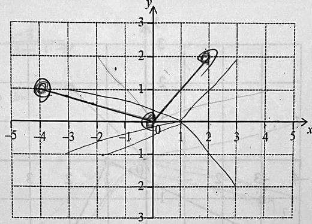

*Figure (c12_1617_q1a): Original scan: the graph of f for −2 ≤ x ≤ 4. Student pen marks overlay the printed graph, so a clean redraw was not attempted.*

(a) On the same set of axes, draw the graph of $f(-x)$. **[2]**

Another function, $g$, can be written as $g(x) = af(x+b)$. The following diagram shows the graph of $g$. *[graph on grid — see scan]*

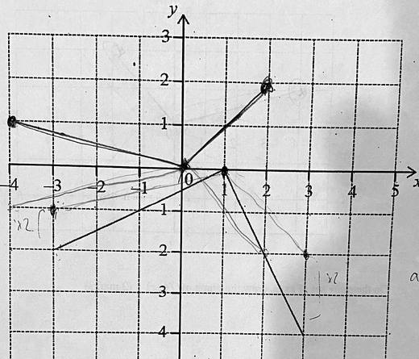

*Figure (c12_1617_q1b): Original scan: the graph of g(x) = a f(x + b). Student pen marks overlay the printed graph.*

(b) Write down the values of $a$ and $b$. **[4]**

#### Question 2

Evaluate $\displaystyle\lim_{x \to 3} \frac{x-3}{3x^2 - 10x + 3}$. **[4]**

#### Question 3

Evaluate $\displaystyle\lim_{x \to 0} \frac{\sqrt{1+x} - \sqrt{1-x}}{x}$. **[4]**

#### Question 4

An arithmetic sequence has $u_1 = \log_c p$ and $u_2 = \log_c pq$ where $c > 1$ and $p, q > 0$.

(a) Show that $d = \log_c q$. **[2]**

(b) Let $p = c^2$ and $q = c^3$, find the value of $\displaystyle\sum_{n=1}^{20} u_n$. **[6]**

#### Question 6

An object moves along a line according to the function $s(t) = \dfrac{4}{t} + 3$ for $t \ge 1$. Find the velocity of the object when its position is 5. **[6]**

#### Question 7

Prove that the function $f(x) = x^3$ has no tangent with slope $-6$. **[5]**

#### Question 8

Consider the function $f(x) = \sin x + c$. The equation of the tangent to $f$ at $x = p$ is $y + 1 = -\dfrac{\sqrt{3}}{2}(x - p)$ where $0 \le p \le 2\pi$. Given that $\dfrac{d}{dx}(\sin x + c) = \cos x$, find the values of $p$ and $c$. **[8]**

### Limits and Review Test 2018–2019

*(folder year; the first page is headed "Math 12 SL – Chapter 2 Test (2017–18)". Questions 4 and 6 are not in the scan — the file names mark them "DNE". Marks as printed.)*

#### Question 1

Let $\sin\theta = \dfrac{\sqrt{5}}{3}$, where $\theta$ is acute.

(a) Find $\cos\theta$. **[2]**

(b) Find $\cos 2\theta$. **[3]**

#### Question 2

The values in the fifth row of Pascal's triangle are shown in the following table. *(the paper originally said "fourth"; corrected by hand to "fifth", and part (a) corrected to "sixth")*

*Table (fifth row of Pascal's triangle): 1, 4, 6, 4, 1.*

(a) Write down the values in the sixth row of Pascal's triangle. **[1]**

(b) Hence or otherwise, find the term with $x^3$ in the expansion of $(2x+3)^5$. **[4]**

#### Question 3

Evaluate the following limits.

(a) $\displaystyle\lim_{x \to 1} \frac{3x^2 + 2x - 5}{x - 1}$ **[3]**

(b) $\displaystyle\lim_{x \to \infty} \left(\sqrt{x^2 + 2x} - \sqrt{x^2 - 3x}\right)$ **[3]**

#### Question 5

If $f(x) = \sqrt{x - 3}$, find $f'(x)$. **[5]**

#### Question 7

The first three terms of a geometric sequence are $\ln x^{16}$, $\ln x^8$, $\ln x^4$, for $x \ge 0$.

(a) Find the common ratio. **[2]**

(b) Solve $\displaystyle\sum_{k=1}^{\infty} 2^{5-k} \ln x = 64$. **[5]**

#### Question 8

A quadratic function $f$ can be written in the form $f(x) = a(x-p)(x-3)$. The graph of $f$ has axis of symmetry $x = 2.5$ and $y$-intercept at $(0, -6)$.

(a) Find the value of $p$. **[1]**

(b) Find the value of $a$. **[2]**

(c) The line $y = kx - 5$ is a tangent to the curve of $f$. Find the values of $k$. **[6]**

#### Question 9

The line $y = 24(x-1)$ is tangent to the curve $y = ax^3 + bx^2 + 4$ at the point $(2, k)$. *(the point label is partly hidden by pen marks; read as $(2,k)$ — consistent with the data)* This tangent line intersects the curve at a different location. Determine this other point of intersection between the tangent line and the curve. **[9]**

### Limits and Review Test 2021–2022

*(single page only — 5 marks; the scan contains Question 1 only)*

#### Question 1

The graph of a function $f$ is given below. *[graph on grid, $-5 \le x \le 5$: see scan]*

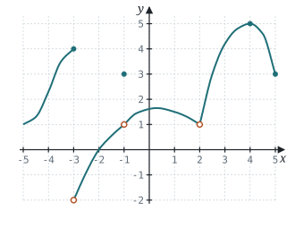

*Figure (c12_2122_q1): redrawn graph and original scan. Approximate redraw (values read from the scan): closed dots at (−3, 4), (−1, 3), (4, 5); open circles at (−3, −2), (−1, 1), (2, 1). The curve between the marked points is smoothed. Check the scan for the exact shape.*

Find:

(a) $f(-3)$. **[1]**

(b) $f(-1)$. **[1]**

(c) $f(4)$. **[1]**

(d) $\displaystyle\lim_{x \to -3} f(x)$. **[1]**

(e) $\displaystyle\lim_{x \to -1} f(x)$. **[1]**

### Limits and Review Test 2023–2024

*(student-marked phone photos; marks as printed)*

#### Question 1

The graph of $f(x)$ is given below. Write down the following: *[graph on grid, $-5 \le x \le 5$ — same graph as the 2021–22 test; see scan]*

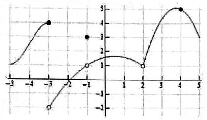

*Figure (c12_2324_q1): redrawn graph and original scan. Approximate redraw (values read from the scan): closed dots at (−3, 4), (−1, 3), (4, 5); open circles at (−3, −2), (−1, 1), (2, 1). The curve between the marked points is smoothed. Check the scan for the exact shape. Same graph as the 2021–22 paper.*

(a) $f(-3)$ **[1]**

(b) $f(4)$ **[1]**

(c) $\displaystyle\lim_{x \to -1} f(x)$ **[1]**

(d) $\displaystyle\lim_{x \to -3} f(x)$ **[1]**

#### Question 2

Evaluate $\displaystyle\lim_{x \to 5} \frac{2x^2 - 50}{x^2 - 6x + 5}$. **[4]**

#### Question 3

Find $f'(x)$ if $f(x) = 2\sqrt{x}$. **[5]**

#### Question 4

Events $A$ and $B$ are such that $P(A) = 0.4$, $P(A \mid B) = 0.25$ and $P(A \cup B) = 0.55$. Find $P(B)$. **[5]**

#### Question 5

Consider the function $f(x) = \dfrac{4x^2 - 36}{x^2 - 2x - 8}$.

(a) Find the equations of the vertical asymptotes. **[3]**

(b) Determine $\displaystyle\lim_{x \to \infty} f(x)$. **[4]**

(c) Write down a geometric description of your result in part (b). **[1]**

#### Question 6

(a) Expand $(x+1)(x^2 - x + 1)$. **[1]**

(b) Find the value of $k$ that makes $f(x)$ continuous everywhere if

$\displaystyle f(x) = \begin{cases} \dfrac{x^3 + 1}{x + 1} & x \ne -1 \\ k + 3 & x = -1 \end{cases}$

[4]

#### Question 7

Consider $y = x^{-2}$.

(a) Show that $\dfrac{d}{dx}(x^{-2}) = -2x^{-3}$. **[4]**

(b) Determine the equation of the tangent line when $x = \dfrac{1}{2}$. Express your answer in the form $y = mx + c$, where $m, c \in \mathbb{Z}$. **[4]**

#### Question 8

Let $f(x) = \ln x + 3$ for $x > 0$.

(a) Show that $f^{-1}(x) = e^{x-3}$. **[2]**

(b) Write down the range of $f^{-1}(x)$. **[1]**

Let $g(x) = e^{(x+1)(x-3)}$.

(c) Find the value of $(f \circ g)(2)$, giving your answer as an integer. **[4]** *(labelled "(a)" again on the paper)*

#### Question 9

The expansion of $(x+h)^8$, where $h > 0$, can be written as $x^8 + ax^7 + bx^6 + cx^5 + dx^4 + \dots + h^8$ where $a, b, c, d \in \mathbb{R}$.

(a) Evaluate $\dbinom{8}{2}$. **[1]**

(b) Find an expression, in terms of $h$, for **[3]**

i. $a$;  ii. $b$.

(c) Given that $a$, $b$ and $d$ are the first three terms of a geometric sequence, find the value of $h$. **[3]**

#### Question 10

The function $f$ is defined by $f(x) = \sin qx$, where $q > 0$. The following diagram shows part of the graph of $f$ for $0 \le x \le 4m$, where $x$ is in radians. There are $x$-intercepts at $x = 0$, $2m$ and $4m$.

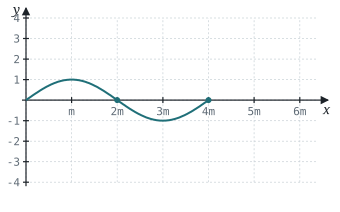

*Figure (c12_2324_q10): Redrawn: f(x) = sin qx drawn with m = π/(2q), so the curve has a maximum at x = m, a minimum at 3m and x-intercepts at 0, 2m and 4m. Gridlines every m horizontally and 1 unit vertically.*

(a) Find an expression for $m$ in terms of $q$. **[2]**

The function $g$ is defined by $g(x) = 3\sin\dfrac{2qx}{3}$.

(b) Describe two transformations which transform $y = f(x)$ to $y = g(x)$. **[4]**

(c) Determine the period of $g(x)$ in terms of $q$. **[2]**

(d) Given that $g'(x) = 2q\cos\dfrac{2qx}{3}$, determine the $x$-coordinates of the points where the tangent to the curve of $g(x)$ is horizontal. Express your answer in terms of $q$. **[6]**

### Limits Test 2024–2025

*IB Math AA SL · 71 marks · calculator not permitted · exact answers unless stated · where asked to differentiate, the definition of the derivative must be used unless otherwise stated*

#### Question 1

Solve the following equations. **[4]**

(a) $\ln(x+2) = 3$, answer in the form $x = e^a + b$ where $a, b \in \mathbb{Z}$.

(b) $10^{2x} = 500$, answer in the form $x = \dfrac{1}{p}\log m + n$, where $m, n, p \in \mathbb{Z}$.

#### Question 2

Evaluate the following limits. **[6]**

(a) $\displaystyle\lim_{x \to 10} \frac{x^2 - 100}{x - 10}$

(b) $\displaystyle\lim_{x \to 16} \frac{\sqrt{x} - 4}{x - 16}$

#### Question 3

Evaluate $\displaystyle\lim_{x \to \infty} \frac{3x+1}{\sqrt{4x^2 - 3x - 7}}$. **[4]**

#### Question 4

A species of bird can nest in two seasons: Spring and Summer. The probability of nesting in Spring is $k$. The probability of nesting in Summer is $\dfrac{k}{2}$. This is shown in the following tree diagram. *[tree diagram: first stage Spring — Nesting / Not Nesting; second stage Summer — Nesting / Not Nesting from each branch; all branches unlabelled]*

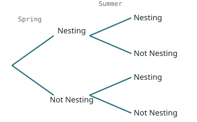

*Figure (c12_2425_q4): Redrawn: two-stage tree, Spring then Summer, with all branches unlabelled for the student to complete.*

(a) Complete the tree diagram to show the probabilities of nesting in each season. Write your answers in terms of $k$. **[2]**

It is known that the probability of not nesting in Spring and not nesting in Summer is $\dfrac{5}{9}$.

(b) Show that $9k^2 - 27k + 8 = 0$. **[4]**

(c) Solve $9k^2 - 27k + 8 = 0$. **[2]**

(d) State why there is only one valid solution for $k$. **[1]**

#### Question 5

Consider the piecewise function $f(x)$ defined below, where $A$ is a constant.

$\displaystyle f(x) = \begin{cases} A^2 x - 4A & x \ge 2 \\ -2 & x < 2 \end{cases}$

Determine all values of $A$ so that $\displaystyle\lim_{x \to 2} f(x)$ exists. **[6]**

#### Question 6

Consider the function defined by $f(x) = \dfrac{2}{3}e^{x-2}$, $0 \le x \le 4$.

(a) Show that the inverse function is given by $f^{-1}(x) = 2 + \ln\!\left(\dfrac{3x}{2}\right)$. **[3]**

The graph of $f$ is reflected in the $x$-axis and then translated parallel to the $y$-axis by 5 units in the positive direction to give the graph of a function $g$.

(b) Write down an expression for $g(x)$ and state its domain. **[3]**

(c) Solve the equation $f(x) = g(x)$. Give your answer in the form $x = a + \ln b$, where $a, b \in \mathbb{Q}$. **[3]**

#### Question 7

(a) Find $f'(x)$ if $f(x) = x^2 + 4x$. **[4]**

(b) Find the equation of the tangent to $f(x) = x^2 + 4x$ at the point where $x = a$. **[3]**

(c) Hence, find the equations of the tangents to $f(x) = x^2 + 4x$ which pass through the point $(1, -4)$. **[4]**

#### Question 8

Let $f(x) = 2\sin x$ and $g(x) = -\tfrac{1}{2}\cos 2x$. Given that $\dfrac{d}{dx}(2\sin x) = 2\cos x$ and $\dfrac{d}{dx}\!\left(-\tfrac{1}{2}\cos 2x\right) = \sin 2x$, find all the $x$-values for which the slope of the tangent lines of $f(x)$ and $g(x)$ are equal. **[6]**

#### Question 9

A function $f$ is defined by $f(x) = \dfrac{2x+6}{3x+6}$, where $x \in \mathbb{R}$, $x \ne 2$. *(paper prints "$x \ne 2$" — almost certainly a typo for $x \ne -2$, the vertical asymptote)*

(a) In the space provided, sketch $f(x)$, clearly labelling the asymptotes and intercepts. **[5]**

(b) Show that $f'(x) = -\dfrac{2}{3(x+2)^2}$. **[5]**

Consider $g(x) = mx + 1$, where $m \in \mathbb{R}$, $m \ne 0$.

(c) Write down the number of solutions to $f(x) = g(x)$ for $m > 0$. **[1]**

(d) Determine the value of $m$ such that $f(x) = g(x)$ has only one solution for $x$. **[2]**

(e) Determine the range of values for $m$, where $f(x) = g(x)$ has two solutions for $x \ge 0$. **[3]**

### Review & Limits Test SL 2025–2026

*IB Math AA SL · 68 marks · calculator not permitted · exact answers unless stated · where asked to find a derivative, the formal definition $f'(x) = \lim_{h \to 0}\frac{f(x+h) - f(x)}{h}$ must be used for full marks*

#### Question 1

Write each of the following expressions in the form $\ln k$, where $k \in \mathbb{Z}^+$.

(a) $\ln 3 + \ln 4$ **[1]**

(b) $3\ln 2$ **[2]**

(c) $-\ln\dfrac{1}{2}$ **[2]**

#### Question 2

Evaluate $\displaystyle\lim_{t \to -3} \frac{t^2 - 9}{t^2 - t - 12}$. **[4]**

#### Question 3

Consider the function $f(x) = a\sin(bx)$ with $a, b \in \mathbb{Z}^+$. The following diagram shows part of the graph of $f$. *[graph: sine curve with amplitude 7 and period $\pi$, drawn from $x = -\tfrac{\pi}{2}$ to about $\tfrac{9\pi}{4}$]*

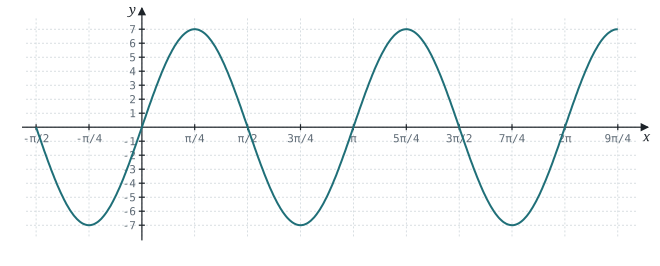

*Figure (c12_2526_q3): Redrawn: f(x) = 7 sin 2x (amplitude 7, period π, matching the scanned graph). x-gridlines every π/4, y-gridlines every 1.*

(a) Write down the value of $a$. **[1]**

(b) Determine the value of $b$. **[3]**

(c) Find the value of $f\!\left(\dfrac{\pi}{12}\right)$. **[3]**

#### Question 4

Sketch the graph of $f(x)$ given that it satisfies the following properties: **[5]**

$\displaystyle \lim_{x \to 0} f(x) = 5,\quad \lim_{x \to 5} f(x) = 10,\quad f(5) = \text{undefined},\quad \lim_{x \to -\infty} f(x) = -\infty,\quad \lim_{x \to \infty} f(x) = 0$

#### Question 5

Consider events $A$ and $B$ such that $P(A') = P(A \cup B) = \dfrac{3}{4}$ and $P(B \mid A) = \dfrac{2}{3}$.

(a) Find $P(A \cap B)$. **[3]**

(b) Show that events $A$ and $B$ are independent. **[3]**

#### Question 6

Consider the function $y = \sqrt{x+1}$.

(a) Show that $y' = \dfrac{1}{2\sqrt{x+1}}$. **[3]**

(b) Hence, find the equation of the tangent to $y = \sqrt{x+1}$ at $x = 3$. **[2]**

(c) Determine the $x$-coordinate of the point where this tangent meets the $x$-axis. **[2]**

#### Question 7

The function $f$ is defined by $f(x) = 5(x+1)(x+3)$ where $x \in \mathbb{R}$.

(a) Write $f(x)$ in the form $a(x-h)^2 + k$, where $a, h, k \in \mathbb{Z}$. **[4]**

(b) Sketch the graph of $y = f(x)$, showing the values of any intercepts with the axes and the coordinates of the vertex. **[4]**

(c) Solve the inequality $f(x) \le 40$. **[4]**

The function $g$ is defined by $g(x) = \ln x$, where $x \in \mathbb{R}$, $x > 0$.

(d) Write down an expression for $(f \circ g)(x)$. **[1]**

(e) Solve the inequality $(f \circ g)(x) \le 40$. **[3]**

#### Question 8

Given that $\dfrac{d}{dx}\cos x = -\sin x$ and $\dfrac{d}{dx}\sin x = \cos x$. Find the values of $x$ where the function $f(x) = \sin x - \cos x$ has a horizontal tangent line. **[6]**

#### Question 9

Consider the function $g(x) = x^2 + 4$, for $x \le 0$.

(a) Find $g^{-1}(x)$. **[3]**

(b) The graph of $g^{-1}(x)$ is translated $p$ units horizontally and $q$ units vertically to create the function $k(x)$. $k(x)$ intersects the line $y = x$ at the point $(5, 5)$ and has a range of $y \le 7$. Determine the value of $p$ and $q$. **[3]**

$k(x)$ also satisfies the conditions for the following function $f(x)$.

$\displaystyle f(x) = \begin{cases} g(x - H) + K, & x \le 1 \\ k(x), & x > 1 \end{cases}$

(c) Write down the values of $H$, $K$ so that $f(x)$ is continuous for all $x \in \mathbb{R}$. **[2]**

(d) Hence, or otherwise, determine the equation of the line of symmetry for $f(x)$. **[2]**

(e) Find the distance between the line in part (d) and the line of symmetry that relates $g(x)$ and $g^{-1}(x)$. **[2]**

## Chapter 3–4 — Derivatives and Applications

### Derivatives Test 2020–2021

*(student-marked scan; marks as printed)*

#### Question 1

Evaluate and simplify $\dfrac{d}{dx}\!\left(\dfrac{2}{3}x^3 + \pi x^2 + 7x + 1\right)$. **[3]**

#### Question 2

Determine $y'$ if $y = \ln(x^2 + 3x)$. **[3]**

#### Question 3

The values of the functions $f$ and $g$ and their derivatives for $x = 1$ and $x = 8$ are shown in the following table.

| $x$ | $f(x)$ | $f'(x)$ | $g(x)$ | $g'(x)$ |
|---|---|---|---|---|
| 1 | 2 | 4 | 9 | $-3$ |
| 8 | 4 | $-3$ | 2 | 5 |

Let $h(x) = f(x)g(x)$.

(a) Find $h(1)$. **[2]**

(b) Find $h'(8)$. **[3]**

#### Question 4

Let $f(x) = e^{3x}$. The line $L$ is normal to the curve of $f$ at $(0, 1)$. Find the equation of $L$ in the form $y = mx + b$. **[5]**

#### Question 5

Let $f(x) = \dfrac{1 + \sin x}{\cos x}$.

(a) Show that $f'(x) = \sec x(\tan x + \sec x)$. **[5]**

(b) Hence, find $f'\!\left(\dfrac{\pi}{6}\right)$. **[2]**

#### Question 6

A body is moving in a straight line. Its displacement, in metres, from a fixed point O is represented by $s(t) = \dfrac{1}{t}$, $t > 0$. Find the acceleration of the body when it is 50 cm from O. **[6]**

#### Question 7

Let $f(x) = x^2$. The following diagram shows part of the graph of $f$. *(diagram not to scale)*

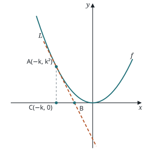

*Figure (c3_2021_q7): Redrawn (not to scale, like the original): y = x², tangent L at A(−k, k²) meeting the x-axis at B, with C(−k, 0) below A. Drawn with k = 1.*

The line $L$ is the tangent to the graph of $f$ at the point $A(-k, k^2)$, and intersects the $x$-axis at point B. The point C is $(-k, 0)$.

(a) Write down $f'(x)$. **[1]**

(b) Find the gradient of $L$. **[1]**

(c) Show that the $x$-coordinate of B is $-\dfrac{k}{2}$. **[5]**

(d) Find the area of triangle ABC, giving your answer in terms of $k$. **[2]**

#### Question 8

Two people A and B are walking along straight lines that meet at a right angle (see diagram). A approaches the intersection at 2 m/s, while B moves away from the intersection at 1 m/s. At what rate is the angle $\theta$ changing when A is 10 m from the intersection and B is 20 m from the intersection? **[7]**

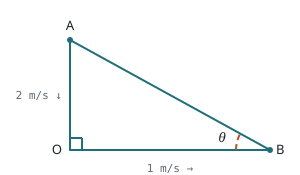

*Figure (c3_2021_q8): Redrawn (not to scale): right angle at the intersection O, person A on the vertical path approaching O, person B on the horizontal path moving away, θ the angle at B. (In the question the lengths are 10 m and 20 m at the instant asked.)*

#### Question 9

Consider the curve given by the equation $y^2 = x^3 + 3x^2$. The graph of this curve is given below.

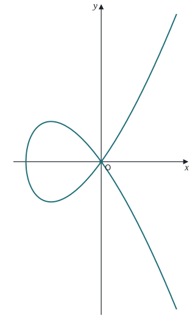

*Figure (c3_2021_q9): Redrawn exactly from y² = x³ + 3x²: a loop for −3 ≤ x ≤ 0 and two branches for x > 0 crossing at the origin.*

(a) Show that $\dfrac{dy}{dx} = \dfrac{3(x+2)}{\pm 2\sqrt{x+3}}$. **[4]** *(the printed form appears to be $\frac{3x(x+2)}{\pm 2x\sqrt{x+3}}$, equivalent for $x \ne 0$)*

(b) At what point(s) does this curve have a horizontal tangent? **[3]**

(c) At what point(s) does this curve have a vertical tangent? **[2]**

(d) Find the equations of the two tangent lines to this curve at the point $(0, 0)$. **[3]**

#### Question 10

The inverse of function $f$ is equal to its first derivative. If $f(2) = 2$, what is the value of $f''(2)$? **[7]** *(the given value is partly hidden by pen circling; read as $f(2) = 2$)*

### Derivatives Test 2021–2022

*(student-marked photos; the scan is incomplete: Question 7 has no page, and the scan stops after Question 9(a). Marks as printed.)*

#### Question 1

Let $f(x) = x^3 \ln x + 4x^3$. Find $f'(x)$. **[3]**

#### Question 2

Evaluate $\displaystyle\lim_{x \to 0} \frac{\sin 2x}{3x}$. **[3]**

#### Question 3

The distance $s$ metres after time $t$ seconds covered by a particle moving along a straight line is given by $s = t^3 - t^2 - t - 2$. Determine the acceleration of the particle when the velocity is zero. **[5]**

#### Question 4

Find the equation of the normal line to $y = x^2 - \dfrac{4}{x}$ at the point $x = 2$. **[6]**

#### Question 5

Let $f(x) = x e^{ax + \ln b}$, where $a, b \in \mathbb{R}$. If $f'(0) = 7$ and $f''(0) = 126$, determine the values of $a$ and $b$. **[8]**

#### Question 6

Two boats A and B travel due North. Initially, boat B is positioned 50 metres due East of boat A. The distances travelled by boat A and boat B, after $t$ seconds, are $x$ metres and $y$ metres respectively. The angle $\theta$ is the radian measure of the bearing of the boat B from boat A. This information is shown on the following diagram. *(diagram not to scale)*

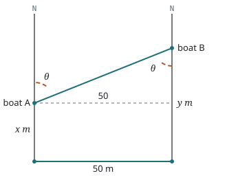

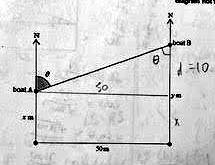

*Figure (c3_2122_q6): redrawn graph and original scan. Redrawn from the scan (not to scale): boats A and B travel due North; B starts 50 m due East of A. After t seconds A has travelled x m and B has travelled y m; θ is the bearing of B from A, and also appears at B. Labels as printed (the scan's "d = 10" is the student's own note).*

(a) Show that $y = x + 50\cot\theta$. **[1]**

At time $T$, the following conditions are true.

- Boat B travelled 10 metres further than boat A.
- Boat B is travelling at double the speed of boat A.
- The rate of change of the angle $\theta$ is $-\dfrac{1}{10}$ radians per second.

(b) Find the speed of boat A at time $T$. **[6]**

#### Question 8

Let $f$ be a differentiable function that satisfies $f(x) + (f(x))^3 = x + x^7$ for all $x \in \mathbb{R}$. Determine the value of $f'(2)$. **[8]**

#### Question 9

Consider the function $f(x) = x^3$. For any $a \ne 0$, the tangent line of $f(x)$ at $x = a$ will intersect $f(x)$ again at another point.

(a) Let $g(x)$ be the tangent line at $x = a$. Show that $g(x) = 3a^2 x - 2a^3$. **[3]**

### Derivatives Test 2023–2024

*(student-marked phone photos; marks as printed)*

#### Question 1

Consider the function $f(x) = \ln x - 5x$.

(a) Find $f'(x)$. **[2]**

(b) Find $f''(x)$. **[2]**

(c) Solve $f'(x) = f''(x)$. **[2]**

#### Question 2

Find $\dfrac{dy}{dx}$ for $y = x^3\cos x$. **[3]**

#### Question 3

The position of an object at time $t$ is given by $s(t) = t^2 - 4t + 1$.

(a) Find the velocity at $t = 3$. **[3]**

(b) Find the time at which the object changes direction. **[2]**

#### Question 4

Find the equation of the tangent to $y = \dfrac{x^2 + 1}{x^3 - 2}$ when $x = 1$. **[6]**

#### Question 5

Find $\dfrac{d}{dx}e^{\sin^2 x}$. **[4]**

#### Question 6

Consider the relation $4y^2 = x(x^2 - x - 6)$. The graph of the relation is shown below.

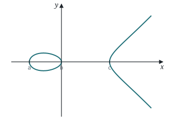

*Figure (c3_2324_q6): Redrawn exactly from 4y² = x(x² − x − 6): a closed loop for −2 ≤ x ≤ 0 and an open branch for x ≥ 3. The x-intercepts are labelled a, b, c as in the question (the scan's labels are not marked with values).*

The $x$-intercepts are $(a, 0)$, $(b, 0)$, and $(c, 0)$ where $a < b < c$.

(a) Write down the values of $a$, $b$, and $c$. **[3]**

(b) Using the equation of the relation, explain why the domain is $[-2, 0] \cup [3, \infty[$. **[2]**

(c) Use implicit differentiation to find $\dfrac{dy}{dx}$. **[3]**

#### Question 7

The following diagram shows a semi-circle of radius 1. *(O is the centre of the flat edge; A is on the vertical radius at the water level; B is on the circle at the water level; the shaded region is the water)*

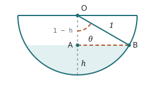

*Figure (c3_2324_q7): Redrawn (not to scale; drawn with θ = 60°): semicircle of radius 1 with centre O on the flat edge, water surface through A and B, OB = 1, OA = 1 − h, depth h, shaded region = water.*

(a) Find $OA$ in terms of $h$. **[1]**

(b) Find $\cos\theta$ in terms of $h$. **[2]**

(c) Find the area of the shaded region in terms of $\theta$. **[3]**

A water tank has a length of 2 m and a cross section in the shape of a semi-circle of radius 1 m. The depth of the water in the tank is $h$. Time is measured in hours.

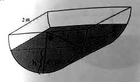

*Figure (c3_2324_q7b): Original scan (low-resolution photo): a tank 2 m long with a semicircular cross-section of radius 1 m, partly full of water to depth h.*

A hole is drilled in the bottom of the tank and water starts draining out.

(d) Find $\dfrac{d\theta}{dt}$ when $V = 2$ given $\dfrac{dV}{dt} = -0.1$. **[4]** *(the part label is scribbled over in the scan; the volume $V$ is the volume of water in the tank)*

#### Question 8

A circle of radius 1 sits inside the parabola $y = x^2$ as shown in the diagram below.

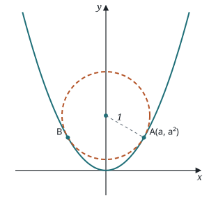

*Figure (c3_2324_q8): Redrawn: parabola y = x² and a circle of radius 1 touching it at A(a, a²) and B(−a, a²); the radius to A is dashed. Drawn with the true value a = √3⁄2, so the centre is (0, 5/4).*

The points A and B are where the circle is touching the parabola. The $x$-coordinate of point A is $a$.

(a) Find the slope of the tangent to $y = x^2$ at the point A. **[2]**

(b) Show that the equation of the normal through A is $y = -\dfrac{x}{2a} + \dfrac{1}{2} + a^2$. **[3]**

(c) Write down the $y$-intercept of the normal line. **[1]**

(d) Find the exact value of $a$. **[4]**

(e) Find the coordinates of the centre of the circle. **[2]**

#### Question 9

Let $f(x) = 6\cos 4x - \sin 8x - 8x$.

(a) Show that $f'(x) = 16\sin^2 4x - 24\sin 4x - 16$. **[4]**

(b) In the interval $\left[0, \dfrac{\pi}{2}\right]$, find the exact value of the $x$-coordinates of the points where the tangent is horizontal. **[5]**

(c) The line $y = -8x + c$ is tangent to the graph of $f$ at an infinite number of points. Find the possible values of $c$. **[7]**

### Derivative + Applications (Ch 3–4) Test 2024–2025

*IB Math 12 SL · 72 marks · calculators not permitted · exact answers unless stated · full marks require appropriate work*

#### Question 1

Find $f'(x)$ if:

(a) $f(x) = x^3 + \ln x$. **[2]**

(b) $f(x) = e^x \sin x$. **[3]**

(c) $f(x) = \sqrt{x^2 + 1}$. **[3]**

#### Question 2

The position of an object is given by $s(t) = t^2 - 4t + 1$.

(a) Find the velocity when $t = 3$. **[3]**

(b) Find the time when the object changes direction. **[2]**

#### Question 3

Let $f(x) = x^3 + ax^2 + bx - 2$.

(a) Find $f'(x)$. **[2]**

(b) Find $f''(x)$. **[2]**

(c) Given that $f$ has an $x$-intercept and inflection point at $x = 1$, find the values of $a$ and $b$. **[5]**

#### Question 4

Let $f(x) = \dfrac{x}{x^2 + 1}$. The graph of $f$ is given below.

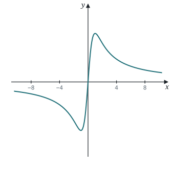

*Figure (c3_2425_q4): Redrawn exactly from f(x) = x/(x² + 1). x-axis ticks at ±4 and ±8 as in the original; the y-axis is not scaled in the original (the maximum is (1, ½)).*

(a) Write down the equation of the asymptote. **[1]**

(b) Find $f'(x)$. **[3]**

(c) Find the coordinates of the stationary points. **[4]**

#### Question 5

A trough with a trapezoidal cross-section is used to transport water. The trough is constructed from a 30 cm wide piece of metal by folding the outside 10 cm of the metal up at an angle $\theta$. The cross-section of the trough is shown in the diagram below.

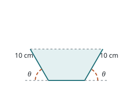

*Figure (c3_2425_q5): Redrawn (not to scale; drawn with θ = 60°): trapezoid cross-section with base 10 cm and two folded sides of 10 cm, each at angle θ to the horizontal. The x, h and 10 labels on the scan are the student's own working.*

(a) Find an expression for the area, $A$, of the trapezoid in terms of $\theta$. **[5]**

(b) Show that $\dfrac{dA}{d\theta} = 100\left(2\cos^2\theta + \cos\theta - 1\right)$. **[4]**

(c) Hence, find the value of $\theta$ that maximizes the area. **[4]**

#### Question 6

Sketch $f(x) = \dfrac{x^2 - 2}{(x-1)^2}$ given $f'(x) = -\dfrac{2(x-2)}{(x-1)^3}$ and $f''(x) = \dfrac{2(2x-5)}{(x-1)^4}$. **[12]**

#### Question 7

Consider the relation $xy^2 - yx^2 - 3 = 0$. Find the $x$-coordinate of the point on the curve where the tangent is vertical. **[8]**

#### Question 8

Let $f(x) = x^2$ and $g(x) = x^2 + 6x + 7$. The diagram below shows the graphs of $y = f(x)$ and $y = g(x)$, and a straight line.

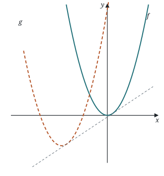

*Figure (c3_2425_q8): Redrawn exactly: y = f(x) = x² (solid), y = g(x) = (x + 3)² − 2 (dashed), and the straight line that touches both (dotted). The line shown is the common tangent y = ⅔x − 1⁄9, which is what the diagram in the original depicts.*

(a) Write $g(x)$ in the form $(x+a)^2 + b$ where $a, b \in \mathbb{Z}$. **[2]**

(b) Describe the transformations that map the graph of $f$ onto the graph of $g$. **[2]**

(c) The line $y = mx + c$ is tangent to both $f$ and $g$. Find the values of $m$ and $c$. **[5]**

### Chapter 3 – Derivatives Test SL 2025–2026

*IB Math AA SL · 65 marks · calculators not permitted · full marks will not be awarded unless appropriate work is shown*

#### Question 1

Consider $f(x) = x^3 + 5x^2 - 8$.

(a) Find $f'(1)$. **[2]**

(b) Find the equation of the tangent to the graph of $f$ at $x = 1$. **[2]**

#### Question 2

Find the derivatives:

(a) $f(x) = 3x - \sqrt{x} + 2\pi$ **[3]**

(b) $f(x) = \ln x + e^x - \dfrac{1}{x^4}$ **[3]**

#### Question 3

Determine the coordinates of the points where the slope of the tangent line to the curve $y = \dfrac{3x}{x^2 - x + 1}$ is zero. **[7]**

#### Question 4

Determine the equation of the tangent line to the curve $y = (\ln x)^4$ at $x = e$. **[5]**

#### Question 5

Let $f(x) = x^2 e^x$ and $g(x) = (x+2)e^x$. Solve $f'(x) = g'(x)$ for $x \in \mathbb{R}$. **[6]**

#### Question 6

A stone is thrown into a pond and a circular ripple spreads over the pond. Its radius is increasing at a rate of 2 m/sec. How fast is the area of the circle increasing at the instant when the radius is 4 m? **[6]**

#### Question 7

(a) Find the derivative of $y = \sin 2x + 2\cos x$. **[2]**

(b) Hence, determine the $x$ values where $0 < x < 2\pi$ in which the normal lines to the curve $y$ is vertical. **[5]**

#### Question 8

A gardener plans to enclose part of their garden with rope. The total area being enclosed is $60\ \text{m}^2$. This will be further divided by rope to make eight identical rectangular areas, each measuring $x$ metres by $y$ metres, where $x, y > 0$. This is shown in the following diagram. *(diagram not to scale)*

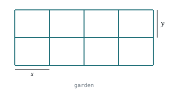

*Figure (c3_2526_q8): Redrawn (not to scale): a rope enclosure divided into 8 identical x m × y m rectangles (4 across, 2 down).*

(a) Find an expression for $y$ in terms of $x$. **[2]**

(b) Show that the total length, $T$ metres, of rope required is given by $T = 12x + \dfrac{75}{x}$. **[2]**

(c) Find an expression for $\dfrac{dT}{dx}$. **[2]**

When $x = k$, $\dfrac{dT}{dx} = 0$.

(d) Find the value of $k$. **[2]**

(e) Hence, calculate the value of $T$ when $x = k$. **[2]**

(f) Find the value of $y$ when $x = k$. **[3]**

#### Question 9

Consider the curve of $(y^2 + 1)^3 = e^{6x}$.

(a) Show that $\dfrac{dy}{dx} = \dfrac{y^2 + 1}{y}$ for $y \ne 0$. **[7]**

(b) Hence, determine the coordinates of all points on this curve where the tangent has gradient 3. **[4]**
