# Grade 11 IB Math AA SL — Test Bank

<!--
NOTES FOR WHOEVER BUILDS THE SITE (e.g. Claude Code)

Source: past chapter tests (2020–2025) and a probability worksheet, transcribed from phone photos/scans of marked student scripts.

Structure
- `##`  = chapter (5 chapters)
- `###` = one paper (a test from a given school year, or the worksheet)
- `####` = one question ("Question N"), numbered as on the original paper
- Parts are paragraphs starting (a), (b)…; sub-parts i., ii. …
- Section-level italic lines directly under a `###` are paper metadata (total marks, calculator rules).
- The probability worksheet (Chapter 5) uses bold "Section N" labels, then `####` questions that restart at 1 in each section.

Math
- LaTeX, inline `$...$` only (no `$$` blocks). Render with KaTeX or MathJax (needs `\dfrac`, `\tfrac`, `\mathbb`, `\circ`, `\begin{pmatrix}`).
- Protect `$...$` from the Markdown parser before parsing (underscores and backslashes inside math).

Marks
- `**[n]**` = mark allocation for the part/question it follows. Some papers (Logarithmics 2023–24) have no visible marks.

Figures
- Each figure is one or two Markdown images followed by an italic caption line starting `*Figure (<id>): ...*`.
- `figures/<id>.svg` = clean redraw. SVGs carry their own <style> using CSS variables with fallbacks
  (--fg, --muted, --accent, --accent2, --accent-soft, --grid, --paper), so if you INLINE the SVG markup
  the site's theme (incl. dark mode) applies; as plain  they use the fallback colours.
- `figures/<id>-scan.jpg` = cropped original scan. Where both exist, the redraw was read off the scan
  (grid graphs): show them side by side so a reader can verify the redraw.

Editorial flags
- Italic notes inside question text in parentheses, e.g. "(paper prints … — almost certainly a typo)" or
  "(Stem partly hidden … reconstructed …)", flag transcription uncertainty. Keep them visible but styled as notes.
-->
## Chapter 1 — Functions and Inequalities

### Ch 1 Test 2021–2022

#### Question 1

Let $f(x) = 4 - 2x - x^2$ for $x \in \mathbb{R}$.

(a) Find the $y$-intercept. **[1]**

(b) Find the $x$-intercepts. **[3]**

The function can be written in the form $f(x) = a(x-p)^2 + q$.

(c) Find the values of $a$, $p$, $q$. **[3]**

(d) Write down the domain and range of $f(x)$. **[2]**

(e) Write down the equation of the axis of symmetry. **[1]**

#### Question 2

The sum of two numbers is $-26$. One number is twelve less than the other. Find the two numbers. **[4]**

#### Question 3

Solve $\sqrt{3-x} - 2 = x + 1$. **[5]**

#### Question 4

Solve and write the solution in interval notation: $\dfrac{5x}{x+2} < -1$. **[6]**

#### Question 5

(a) Show that $(2n-1)^2 + (2n+1)^2 = 8n^2 + 2$, where $n \in \mathbb{Z}$. **[2]**

(b) Hence, or otherwise, prove that the sum of the squares of any two consecutive odd integers is even. **[3]**

#### Question 6

Solve $x + 2 \le |3x - 4|$. **[5]**

#### Question 7

A farmer has 480 metres of fencing with which to build two animal pens with a common side. A diagram of the enclosure is shown.

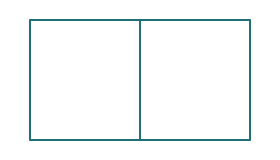

*Figure (c1_2122_q7): Redrawn: a rectangular enclosure split into two pens by one shared fence. The original marks the side lengths with x.*

(a) Find the maximum area of the enclosure. **[6]**

(b) Hence, or otherwise, determine the dimensions of the enclosure. **[2]**

#### Question 8

The quadratic equation $(k-1)x^2 + 2x + (2k-3) = 0$, where $k \in \mathbb{R}$, has real distinct roots. Find the range of possible values for $k$. **[5]**

#### Question 9

A ball is thrown vertically into the air from a height of 10 ft. Its height in feet above the ground after $t$ seconds is given by $h(t) = 10 + 8t - 2t^2$.

(a) Find the maximum height of the ball and the time when this occurs. **[3]**

(b) Find when the ball hits the ground. **[4]**

When the ball hits the ground, its velocity is reduced such that the ball bounces to 80% of its height and continues to do so indefinitely.

(c) Determine the total vertical distance travelled by the ball. **[6]**

#### Question 10

In the following two arithmetic sequences, how many terms are identical? **[7]**

① $\{2, 5, 8, 11, \dots\}$ — 60 terms

② $\{3, 5, 7, \dots\}$ — 50 terms

### Ch 1 Test 2022–2023

#### Question 1

Solve $x^2 + 2x - 8 \ge 0$. Express your answer using interval notation. **[5]**

#### Question 2

The fifth term of an arithmetic sequence is equal to 6 and the sum of the first twelve terms is 45. Find the first term and the common difference. **[6]**

#### Question 3

Consider the function $f(x) = 2x^2 + 12x + 5$.

(a) Write $f(x)$ in the form $f(x) = a(x-h)^2 + k$. **[4]**

(b) Write down the coordinates of the vertex. **[2]**

#### Question 4

The following diagram shows part of the graph of a quadratic function $f$.

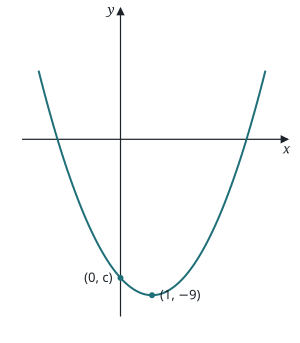

*Figure (c1_2223_q4): Redrawn. Upward parabola with vertex (1, −9), crossing the y-axis at (0, c).*

The vertex is at $(1, -9)$ and the graph crosses the $y$-axis at the point $(0, c)$. The function can be written in the form $f(x) = (x-h)^2 + k$.

(a) Write down the values of $h$ and $k$. **[2]**

(b) Find the value of $c$. **[2]**

(c) Let $g(x) = -(x-3)^2 + 1$. Find the $x$-coordinates of the points of intersection of $f$ and $g$. **[7]**

#### Question 5

Solve $x - \sqrt{x-4} = 6$. **[5]**

#### Question 6

Solve $\dfrac{2x+8}{x+1} \le 6 - x$. **[7]**

#### Question 7

A running track with semi-circular ends has a perimeter of 400 m. Let $l$ be the length of each of the straight sections of the track and let $r$ be the radius of the semi-circular ends.

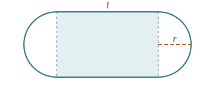

*Figure (c1_2223_q7): Redrawn: straight sections of length l, semicircular ends of radius r. The rectangle inside the track is shaded.*

(a) Show that the area, $A$, of the rectangular region enclosed by the track can be written as $A = 400r - 2\pi r^2$. **[3]**

(b) Hence, find the value of $l$ that maximizes $A$. **[4]**

#### Question 8

Solve $\left|\dfrac{x}{x+1}\right| \ge 2$. **[7]**

#### Question 9

*(Stem partly hidden under handwriting on the scan — reconstructed from what's legible and the working; check against the original.)* Consider the quadratic function $f(x) = a(x-p)(x+p)$, where $p > 0$. The graph of $f$ passes through the points $(0, -9)$ and $(1, -5)$.

(a) Show that $a = \dfrac{9}{p^2}$. **[2]**

(b) Hence, find the values of $a$ and $p$. **[4]**

(c) The line $y = -4mx - (9 - m)$ intersects the graph of $f$ in two points. Find the range of values of $m$. **[6]**

### Ch 1 Test 2024–2025

#### Question 1

Find (in any form) the equation of the quadratic whose graph: **[6]**

(a) has $x$-intercepts at $x = 1, 5$ and passes through the point $(2, -9)$;

(b) has vertex $(2, -3)$ and has $y$-intercept $y = 5$.

#### Question 2

The second term of an arithmetic sequence is 10 and the fourth term is 22.

(a) Find the value of the common difference. **[2]**

(b) Find an expression for $u_n$, the $n$th term. **[2]**

#### Question 3

Solve the following inequalities: **[6]**

(a) $x^2 \ge 4x$

(b) $x^2 - 11x + 30 \le 0$

(c) $2x^2 + 9 > 9x$

#### Question 4

Solve the following equations:

(a) $\sqrt{2x-3} = 7$ **[2]**

(b) $5 + \sqrt{x+7} = x$ **[3]**

#### Question 5

If Bob wants to build a garden with 100 m of fencing, find the dimensions of the garden that will maximize the area when one side of the garden is along the house. **[6]**

#### Question 6

(a) Prove that $2 - \dfrac{4}{m+1} + \dfrac{1}{(m+1)^2} = \dfrac{2m^2 - 1}{(m+1)^2}$ for $m \ne -1$. **[3]**

(b) Hence, or otherwise, solve $2 - \dfrac{4}{m+1} + \dfrac{1}{(m+1)^2} > 0$. Express your answer in interval notation. **[4]**

#### Question 7

Solve $2 \le |x^2 - 9| < 9$. **[6]**

#### Question 8

Let $f(x) = x^2 + 2x - 2k$ and $g(x) = 9 - kx$. The graphs of $f$ and $g$ intersect at most once. Find the possible values of $k$. **[8]**

#### Question 9

Suppose that $k > 0$ and that the line with equation $y = 3kx + 4k^2$ intersects the parabola with equation $y = x^2$ at points $P$ and $Q$, as shown. $O$ is the origin.

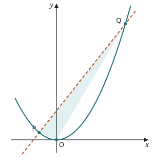

*Figure (c1_2425_q9): Redrawn (shape drawn with k = 1). Parabola y = x², line y = 3kx + 4k², triangle OPQ shaded.*

(a) Determine the intersection points $P$ and $Q$. Express your answers in terms of $k$. **[4]**

Let $S(-k, 0)$ and $T(4k, 0)$ be two additional points in the diagram.

(b) Show that the areas of $\triangle PSO$ and $\triangle QTO$ are $\tfrac{1}{2}k^3$ and $32k^3$ respectively. **[3]**

(c) Determine the area of trapezoid $PSTQ$. **[2]**

The area of $\triangle OPQ$ is 80.

(d) Determine the slope of the line. **[3]**
## Chapter 2 — Graphing and Polynomials

### Graphing and Polynomials Test 2023–2024
*IB Math AA SL · 60 marks · calculator not permitted · exact answers unless stated*

#### Question 1

The graph of $f(x)$ is shown below with a solid line and $g(x)$ is shown with a dotted line.

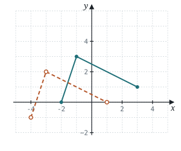

*Figure (c2_2324_q1): redrawn graph and original scan. Points read: f = (−2, 0) → (−1, 3) → (3, 1); g = (−4, −1) → (−3, 2) → (1, 0). Consistent with g(x) = f(x + 2) − 1.*

(a) On the grid above, sketch the graph of $y = f(x-1) + 2$. **[2]**

(b) Find $g(x)$ in terms of $f(x)$. **[2]**

#### Question 2

The diagram below shows the graph of $y = f(x)$.

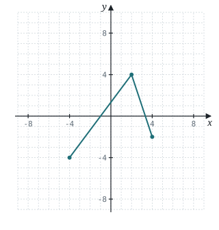

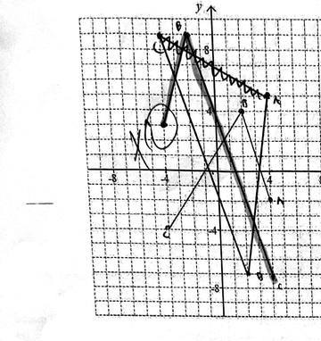

*Figure (c2_2324_q2): redrawn graph and original scan. Points read: (−4, −4) → (2, 4) → (4, −2).*

On the same set of axes, sketch $y = 2f(-x) + 1$. **[4]**

#### Question 3

The diagram below shows the graph of $y = f(x)$.

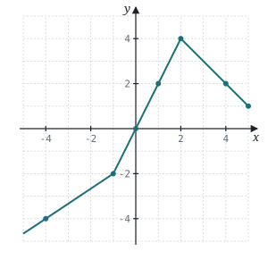

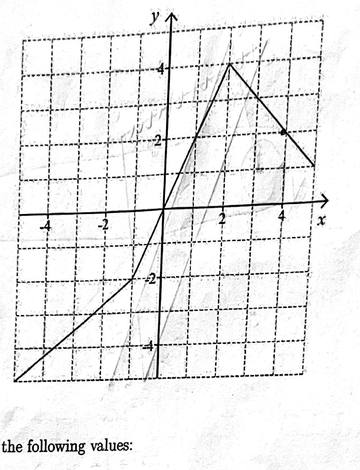

*Figure (c2_2324_q3): redrawn graph and original scan. Points read: (−4, −4), (−1, −2), (0, 0), (1, 2), (2, 4), (4, 2), (5, 1). The left piece runs off the grid at x = −5.*

(a) Determine the following values: **[3]**

i. $f(2)$  ii. $(f \circ f)(2)$

(b) Solve the equations: **[3]**

iii. $f(x) = -2$  iv. $f(x) = x$

#### Question 4

The graph below shows the function $y = f(x)$.

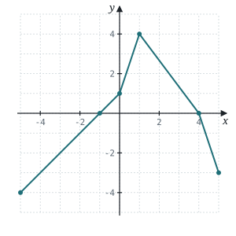

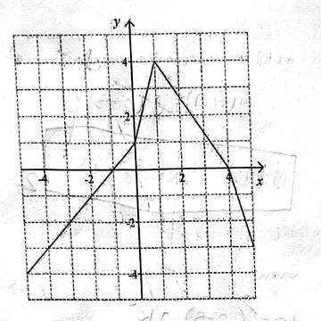

*Figure (c2_2324_q4): redrawn graph and original scan. Points read: (−5, −4) → (0, 1) → (1, 4) → (4, 0) → (5, −3). The first piece passes through (−1, 0).*

On the axes below, sketch the graph of $y = |f(x)|$. **[3]**

#### Question 5

Consider the functions $f(x) = x - 3$ and $g(x) = x^2 + k^2$, where $k$ is a real constant.

(a) Write down an expression for $(g \circ f)(x)$. **[2]**

(b) Given that $(g \circ f)(2) = 10$, find the possible values of $k$. **[3]**

#### Question 6

Consider the function $f(x) = -(x-1)^2 + 4$. Let $g(x) = -3x^2 + 3$. The graph of $g$ is obtained from $f$ by a translation of $\begin{pmatrix} p \\ q \end{pmatrix}$, followed by a vertical stretch of scale factor $r$. Find the values of $p$, $q$ and $r$. **[6]**

#### Question 7

Let $f(x) = \dfrac{x+a}{x+b}$ where $a, b \in \mathbb{Z}$. The graph of $y = f(x)$ is shown below.

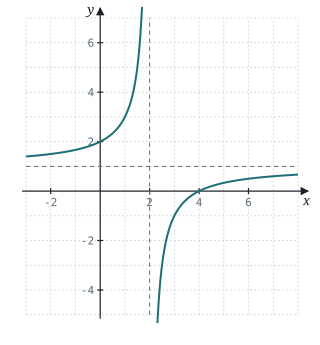

*Figure (c2_2324_q7): Redrawn from the scan: asymptotes x = 2 and y = 1, intercepts (0, 2) and (4, 0).*

(a) Write down the values of $a$ and $b$. **[2]**

Let $g(x) = kx - k$ where $k \in \mathbb{R}$.

(b) When $k = 1$, add the graph of $y = g(x)$ to the diagram above. **[2]**

(c) Find the restrictions on the value of $k$ if the graphs of $y = f(x)$ and $y = g(x)$ intersect twice. **[5]**

#### Question 8

The function $f$ is defined by $f(x) = \dfrac{4x+1}{x+4}$, where $x \in \mathbb{R}$, $x \ne -4$. *(paper prints "$x \ne 4$" — almost certainly a typo)*

(a) For the graph of $f$, **[3]**

i. write down the equation of the vertical asymptote;

ii. find the equation of the horizontal asymptote.

(b) Find $f^{-1}(x)$. **[4]**

(c) Using an algebraic approach, show that the graph of $f^{-1}$ is obtained by a reflection of the graph of $f$ in the $y$-axis followed by a reflection in the $x$-axis. **[4]**

The graphs of $f$ and $f^{-1}$ intersect at $x = p$ and $x = q$, where $p < q$.

(d) Find the value of $p$ and the value of $q$. **[3]**

#### Question 9

A **functional square root** of a function $g(x)$ is a function $f(x)$ such that $(f \circ f)(x) = g(x)$ for all $x$ in the domain of $g(x)$.

(a) Show that $f(x) = x^2 + 1$ is a functional square root of $g(x) = x^4 + 2x^2 + 2$. **[2]**

(b) Write down a functional square root for each of the following functions: **[2]**

i. $g(x) = x + 2$  ii. $g(x) = x^9$

(c) Determine a functional square root of $g(x) = 27x^4 + 18x^3 - 30x^2 - 11x + 8$ by using an algebraic method. **[5]**

### Graphing and Polynomials Test 2024–2025

#### Question 1

The graph of $y = f(x)$ for $0 \le x \le 10$ is shown in the following diagram. The graph intercepts the axes at $(10, 0)$ and $(0, 5)$.

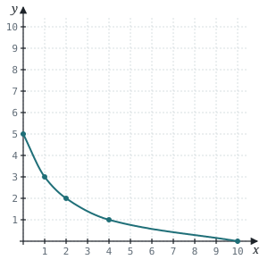

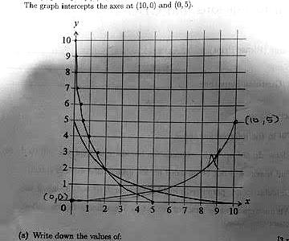

*Figure (c2_2425_q1): redrawn graph and original scan. Grid points read: (0, 5), (1, 3), (2, 2), (4, 1), (10, 0). The curve between them is smoothed. Values match the marked-correct answers f(4) = 1 and f⁻¹(3) = 1.*

(a) Write down the values of: **[3]**

i. $f(4)$  ii. $f \circ f(4)$  iii. $f^{-1}(3)$

(b) On the axes above, sketch the graph of $y = f^{-1}(x)$. Show clearly where the graph intercepts the axes. **[2]**

#### Question 2

The graph below shows the function $y = f(x)$ as a solid line, and $y = g(x)$ as a dotted line.

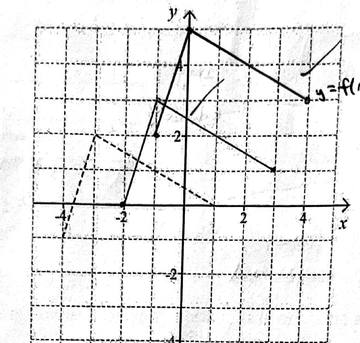

*Figure (c2_2425_q2): redrawn graph and original scan. Points read: f = (−2, 0) → (−1, 3) → (3, 1); g = (−4, −1) → (−3, 2) → (1, 0). Consistent with g(x) = f(x + 2) − 1. Same graph as the 2023–24 paper.*

(a) On the graph above, sketch the graph of $y = f(x-1) + 2$. **[2]**

(b) Find $g(x)$ in terms of $f(x)$. **[2]**

#### Question 3

On January 1st, 2025, the Faber Car Company will release a new car to global markets. The company expects to sell 40 cars in January 2025. The number of cars sold each month can be modelled by a geometric sequence where $r = 1.1$.

(a) Use this model to find the number of cars that will be sold in December 2025. **[2]**

(b) Use this model to find the total number of cars that will be sold in the year 2025. **[2]**

(c) Use this model to find the total number of cars that will be sold in the year 2026. **[3]**

#### Question 4

The graph of $y = f(x)$ has axes intercepts at $(6, 0)$ and $(0, 4)$ and asymptotes at $x = 2$ and $y = -8$. Determine the coordinates of the axes intercepts and equations of asymptotes for the following graphs:

(a) $y = -f(x)$ **[4]**

(b) $y = f(2x)$ **[4]**

#### Question 5

The diagram below shows the function $y = f(x)$.

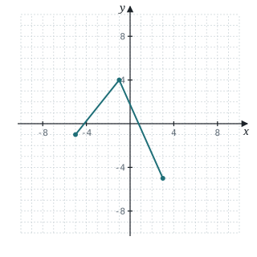

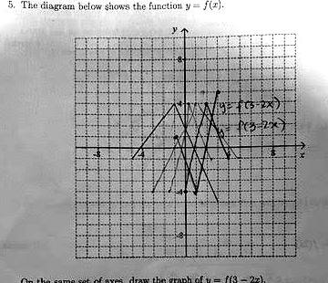

*Figure (c2_2425_q5): redrawn graph and original scan. Points read: (−5, −1) → (−1, 4) → (3, −5). This is the least certain one: the student drew three attempts over it.*

On the same set of axes, draw the graph of $y = f(3 - 2x)$. **[4]**

#### Question 6

(a) In the space below, sketch a graph of $f(x) = \sqrt{x+4}$ and $g(x) = x^3$. **[4]**

(b) Solve the inequality $f(x) < g(x)$. **[2]**

#### Question 7

Let $f(x) = |mx|$ where $m \in \mathbb{R}$ and $g(x) = |x - 2|$.

(a) Find the expanded expressions for $(x-2)^2$ and $(-x+2)^2$. **[2]**

(b) By sketching graphs of $y = f(x)$ and $y = g(x)$, determine the restrictions on the value of $m$ if the equation $f(x) = g(x)$ has **[8]**

i. one solution;  ii. two solutions.

(c) Prove your answers to part (b) algebraically. **[7]**

#### Question 8

Let $f(x) = \dfrac{2x-1}{x-1}$ and $g(x) = \dfrac{1}{x}$.

(a) Show that $2 + \dfrac{1}{x-1} = \dfrac{2x-1}{x-1}$. **[2]**

(b) Hence, describe the transformations that map the graph of $y = f(x)$ onto $y = g(x)$. **[3]**

Let $h(x) = f(x+k) + k$.

(c) Show that $h^{-1}(x) = \dfrac{1}{x-2-k} - k + 1$. **[4]**

(d) Determine the value of $k$ so that $h(x) = h^{-1}(x)$. **[2]**

(e) Hence, calculate the distance between a line of symmetry of the graph of $y = h(x)$ and a parallel line of symmetry of the graph of $y = g(x)$. **[5]**
## Chapter 3 — Exponentials and Logarithms

### Logarithmics Test 2021–2022

#### Question 1

Solve the equation $9^x = 27^{2-2x}$. **[5]**

#### Question 2

(a) Write down the value of $\log_3 27$. **[1]**

(b) Write down the value of $\log_8 \tfrac{1}{8}$. **[1]**

(c) Write down the value of $\log_{16} 4$. **[1]**

(d) Hence, or otherwise, solve $\log_3 27 + \log_8 \tfrac{1}{8} + \log_{16} 4 = \log_4 x$. **[3]**

#### Question 3

**In this question, give all answers to two decimal places.** Karl invests 1000 USD in an account that pays a nominal annual interest of 3.5%, compounded quarterly. He leaves the money in the account for 5 years.

(a) Calculate the amount of money he has in the account after 5 years. **[3]**

(b) Write down the amount of interest he earned after 5 years. **[1]**

(c) Karl decides to donate this interest to a charity in France. The charity receives 170 euros (EUR). The exchange rate is 1 USD = $t$ EUR. Calculate the value of $t$. **[2]**

#### Question 4

Solve the equation $\log_3(x+4) = 2 - \log_3(x-4)$. **[5]**

#### Question 5

Let $f(x) = \log_3 \tfrac{x}{2} + \log_3 16 - \log_3 4$ for $x > 0$.

(a) Show that $f(x) = \log_3 2x$. **[2]**

(b) Find the value of $f(0.5)$ and $f(4.5)$. **[3]**

The function $f$ can also be written in the form $f(x) = \dfrac{\ln ax}{\ln b}$.

(c) Write down the value of $a$ and $b$. **[2]**

#### Question 6

An arithmetic sequence has the first term $\ln a$ and a common difference of $\ln 3$. The 13th term in the sequence is $8 \ln 9$. Find the value of $a$. **[6]**

#### Question 7

Solve the equation $2 \ln x = \ln 9 + 4$. Give your answer in the form $x = pe^q$, where $p, q \in \mathbb{Z}^+$. **[5]**

#### Question 8

Let $f(x) = \ln\!\left(\dfrac{a^{2x^2}}{a^{7+3x}}\right)$ where $a > 0$, $a \ne 1$.

(a) Show that $f(x) = 2x^2 \ln a - 7 \ln a - 3x \ln a$. **[4]**

(b) Hence, determine the exact values of the $x$-intercepts. **[4]**

(c) Given that $f(-1) = 1$, determine the exact value of $a$. **[3]**

#### Question 9

Consider the function $f(x) = \dfrac{\ln x}{x}$.

(a) Sketch the graph of $f$, labelling clearly the asymptote, the $x$-intercept and the maximum point. **[3]**

(b) Write down the domain and range of $f(x)$. **[2]**

(c) The line $y = k$ intersects $f(x)$ at only one point. Determine the possible values of $k$. **[3]**

Now let $g(x) = \dfrac{\ln(-x)}{x}$ and $h(x) = \dfrac{-\ln(-x)}{x}$.

(d) Determine a single transformation that maps $f(x)$ to $h(x)$. **[2]**

(e) Find the values of $x$ such that $h(x) > g(x)$. **[2]**

### Logarithmics Test 2022–2023

#### Question 1

Solve $9^{4x-1} = 27^{x-3}$. Express your answer in the form $\dfrac{p}{q}$ where $p, q \in \mathbb{Z}$. **[4]**

#### Question 2

Solve $3(5^x) = 48$. Leave your answer in exact value using only common logarithms. **[4]**

#### Question 3

Let $a = \log x$, $b = \log y$ and $c = \log z$. Write $\log\!\left(\dfrac{x^2\sqrt{y}}{z^3}\right)$ in terms of $a$, $b$ and $c$. **[6]**

#### Question 4

The number of bacteria, $N$, can be modelled by the equation $N = N_0 e^{kt}$ where $N_0$ is the initial number and $t$ is measured in minutes. After 15 minutes it is found that $\dfrac{N}{N_0} = 1.3$.

(a) Find the value of $k$. **[3]**

(b) Find the least whole number of minutes for which $\dfrac{N}{N_0} > 2.5$. **[4]**

#### Question 5

Sketch the graph of $f(x) = \ln\!\big((x-2)^2\big) + 1$, being sure to include any axes intercepts and the equations of any asymptotes. **[5]**

#### Question 6

Solve $\log_{2x} 32 = 3$. Leave your answer in the form $\sqrt[3]{a}$ where $a \in \mathbb{N}$. **[5]**

#### Question 7

A population increases by 23 percent per day. Find the time it takes for the population to reach 8 times the original amount, leaving your answer in the form $\dfrac{a \ln b}{\ln c - d \ln e}$ where $a, b, c, d, e \in \mathbb{Z}$. **[5]**

#### Question 8

Solve the equation $\tfrac{1}{2}\log_2 x - \log_{32} x = 4$. Express your answer in the form $a^b$ where $a, b \in \mathbb{Q}$. **[5]**

#### Question 9

The function $f$ is defined for $x > 3$ by $f(x) = 2\ln x + \ln(x-2) - \ln(x^3 - 5x^2 + 6x)$. Find $f^{-1}(x)$. **[8]**

#### Question 10

Consider the function $f(x) = a^x$ where $x, a \in \mathbb{R}$ and $x > 0$, $a > 1$. The graph of $f$ contains the point $\left(\tfrac{2}{3}, 4\right)$.

(a) Show that $a = 8$. **[2]**

(b) Find an expression for $f^{-1}(x)$. **[1]**

(c) Find the value of $f^{-1}(\sqrt{32})$. **[3]**

Consider the arithmetic sequence $\log_8 27$, $\log_8 p$, $\log_8 q$, and $\log_8 125$, where $p, q > 1$.

(d) Show that $27$, $p$, $q$ and $125$ are consecutive terms in a geometric sequence. **[4]**

(e) Find the value of $p$ and the value of $q$. **[5]**

### Logarithmics Test 2023–2024
*(mark allocations not visible on most pages of this scan)*

#### Question 1

Let $a = \log 5$ and $b = \log 7$.

(a) Find the following in terms of $a$ and/or $b$:

i. $\log 175$  ii. $\log 500$

(b) Write the following as a single logarithm:

i. $a + b$  ii. $2b - a$

#### Question 2

Given that $2^m = 8$ and $2^n = 32$:

(a) Write down the value of $m$ and $n$.

(b) Hence or otherwise solve $8^{2x+1} = 32^{2x-3}$.

#### Question 3

Let $f(x) = (\ln x)^2 - \ln x$. The diagram below shows the graph of $y = f(x)$.

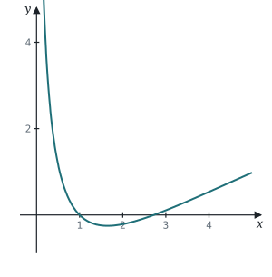

*Figure (c3_2324_q3): Redrawn exactly from f(x) = (ln x)² − ln x.*

(a) Write down the equation of the vertical asymptote.

(b) Find the coordinates of the $x$-intercepts.

(c) Find the coordinates of the minimum point.

#### Question 4

Let $f(x) = \ln x$ and $g(x) = \dfrac{1}{e^x - 1}$.

(a) Write down the domain of  i. $f(x)$  ii. $g(x)$

(b) Determine the function $(g \circ f)(x)$.

(c) Determine the domain of $(g \circ f)(x)$.

#### Question 5

Solve $\dfrac{1}{2^x} = 12(3)^{x+2}$. Write your answer in the form $x = a\dfrac{\log m}{\log n}$ where $m, n \in \mathbb{Z}$.

#### Question 6

The graph below shows the function $f(x) = a(b^x) + c$ where $a, b, c \in \mathbb{Z}$. There is a horizontal asymptote at $y = 2$. The graph passes through the points $(1, -1)$ and $(2, -7)$.

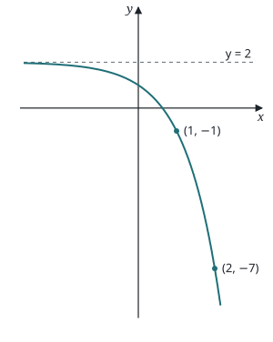

*Figure (c3_2324_q6): Redrawn from the data in the question. Asymptote y = 2, passing through (1, −1) and (2, −7).*

(a) Write down the value of $c$. **[1]**

(b) Find the values of $a$ and $b$. **[4]**

The graph of $f(x)$ is then translated 3 units to the right and 1 unit down to produce a new function $g(x)$.

(c) Determine the equation for $g(x)$. **[2]**

#### Question 7

Solve the equation $\log_4 2 \times \log_8 4 \times \log_{16} 8 \times \cdots \times \log_{2^{n+1}}(2^n) = \dfrac{1}{17}$.

#### Question 8

Let $f(x) = 1 + e^{1-x}$. The diagram below shows the graphs of $y = f(x)$ and $y = f^{-1}(x)$. The area completely bound by the two graphs and their asymptotes is shaded.

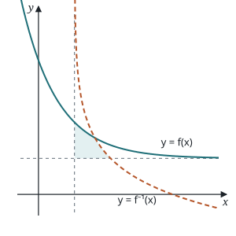

*Figure (c3_2324_q8): Redrawn exactly. y = f(x) solid, y = f⁻¹(x) dashed, asymptotes x = 1 and y = 1, bounded region shaded.*

(a) Determine the function $f^{-1}(x)$. **[2]**

(b) Describe a transformation that maps the graph of $y = f(x)$ onto the graph of $y = f^{-1}(x)$. **[1]**

(c) Write down the equation of the asymptote of  i. $y = f(x)$ **[1]**  ii. $y = f^{-1}(x)$ **[1]**

(d) Find the coordinates of the point of intersection of the two graphs. **[2]**

(e) Find the $x$-coordinate of the point of intersection between the graph of $y = f^{-1}(x)$ and the horizontal asymptote of the graph of $y = f(x)$. **[2]**

#### Question 9

The length of time, $T$, a mobile phone battery lasts in hours depends on the number of times, $n$, that it has been charged and is determined by the equation $T = 20e^{-0.003n} + 8$.

(a) Write down the number of hours a battery in a new phone lasts. **[1]**

(b) For this function

i. write down the equation of the asymptote; **[1]**

ii. sketch the graph of the function for $0 \le n \le 1000$, clearly showing the axis intercept and asymptote. **[2]**

A certain fully charged phone lasts for at least 20 hours.

(c) Find the maximum number of times it has been recharged. **[3]**

It takes 2 hours to charge the phone. Let $A$ be the minimum possible age of the phone in hours.

(d) Show that after the phone has been used and recharged $n$ times then $A = \dfrac{20(1 - e^{-0.003n})}{1 - e^{-0.003}} + 10n$. **[3]**

Paul inherits a phone from his brother. The phone is fully charged. The first time he uses it he notices that the battery lasts less than 20 hours.

(e) Find the minimum age of the phone when Paul receives it. Write your answer to the nearest day. **[3]**
## Chapter 4 — Trigonometry

### Trigonometry Test 2020–2021

#### Question 1

The following diagram shows a circle with centre $O$ and radius $r$.

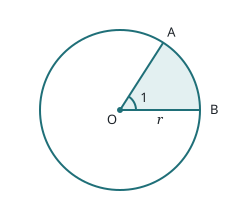

*Figure (t_2021_q1): Redrawn (not to scale): ∠AOB = 1 radian, sector AOB shaded.*

Points $A$ and $B$ lie on the circumference of the circle, and $\angle AOB = 1$ radian. The perimeter of the shaded region is 12.

(a) Find the value of $r$. **[3]**

(b) Hence, find the exact area of the non-shaded region. **[3]**

#### Question 2

Let $\sin\theta = \dfrac{\sqrt{5}}{3}$, where $\theta$ is acute.

(a) Find $\cos\theta$. **[3]**

(b) Find $\cos 2\theta$. **[2]**

#### Question 3

(a) Show that the equation $2\cos^2 x + 5\sin x = 4$ may be written in the form $2\sin^2 x - 5\sin x + 2 = 0$. **[1]**

(b) Hence, solve the equation $2\cos^2 x + 5\sin x = 4$, where $0 \le x \le 2\pi$. **[5]**

#### Question 4

Consider $g(x) = 3\sin 2x$.

(a) Write down the period of $g$. **[1]**

(b) Sketch the curve of $g$ for $0 \le x \le 2\pi$. **[3]**

(c) Write down the number of solutions to the equation $g(x) = 2$, for $0 \le x \le 2\pi$. **[2]**

#### Question 5

Prove $\dfrac{1 + \sin x}{1 - \sin x} = 2\sec^2 x + 2\sec x \tan x - 1$. **[5]**

#### Question 6

The following diagram shows triangle $ABC$, with $AB = 10$, $BC = x$ and $AC = 2x$.

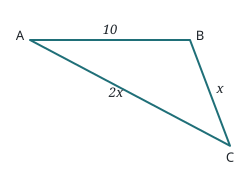

*Figure (t_2021_q6): Redrawn to the question's data: AB = 10, BC = x, AC = 2x.*

Given that $\cos C = \tfrac{3}{4}$, find the area of the triangle. Give your answer in the form $\dfrac{p\sqrt{q}}{2}$, where $p, q \in \mathbb{Z}^+$. **[7]**

#### Question 7

Let $f(x) = 6x\sqrt{1 - x^2}$, for $-1 \le x \le 1$, and $g(x) = \cos x$, for $0 \le x \le \pi$. Let $h(x) = (f \circ g)(x)$.

(a) Write $h(x)$ in the form $a\sin(bx)$ where $a, b \in \mathbb{Z}$. **[5]**

(b) Hence find the range of $h$. **[2]**

(c) Suppose $h(x)$ is given a translation of $\tfrac{\pi}{3}$ to the right, and $\pi$ downwards to create a new function $z(x)$. Find an equation for $z(x)$ and state its new range. **[3]**

#### Question 8

(a) Show that $\log_9(\cos 2x + 2) = \log_3\sqrt{\cos 2x + 2}$. **[3]**

(b) Hence or otherwise, solve $\log_3(2\sin x) = \log_9(\cos 2x + 2)$ for $0 < x < \tfrac{\pi}{2}$. **[5]**

#### Question 9

Consider $f(x) = \sqrt{x}\sin\!\left(\tfrac{\pi}{4}x\right)$ and $g(x) = \sqrt{x}$ for $x \ge 0$. The first time the graphs of $f$ and $g$ intersect is at $x = 0$. The set of all non-zero values that satisfy $f(x) = g(x)$ can be described as an arithmetic sequence, $u_n = a + bn$ where $n \ge 1$.

(a) Find the two smallest non-zero values of $x$ for which $f(x) = g(x)$. **[5]**

(b) Find the value of $a$ and $b$. **[4]**

(c) At point $P$, the graph of $f$ and $g$ intersect for the 21st time. Find the coordinates of $P$. **[4]**

### Trigonometry Test 2022–2023
*IB Math AA SL · 61 marks · calculator permitted · exact or 3 s.f. unless otherwise stated*

#### Question 1

Determine the following values exactly.

(a) $\cos\!\left(\tfrac{5\pi}{2}\right)$ **[2]**  (b) $\sin\!\left(\tfrac{5\pi}{4}\right)$ **[2]**  (c) $\tan\!\left(-\tfrac{\pi}{3}\right)$ **[2]**

#### Question 2

Let $\sin x = \tfrac{1}{7}$ and $\tfrac{\pi}{2} < x < \pi$. Find the value of the following exactly, in simplest radical form.

(a) $\cos x$ **[3]**  (b) $\tan x$ **[2]**  (c) $\sin 2x$ **[3]**

#### Question 3

Solve the equation $2\sin^2 x - 9\sin x + 4 = 0$ for $0 \le x \le 2\pi$. **[5]**

#### Question 4

Given that $\sin p = \tfrac{2}{3}$ and $\cos q = -\tfrac{1}{4}$, with $p$ and $q$ both in the interval $\left(\tfrac{\pi}{2}, \pi\right)$, find $\cos(p - q)$. Answer in the form $\dfrac{\sqrt{a} + b\sqrt{c}}{d}$. **[4]**

#### Question 5

The volume of water, $V$, in millions of gallons, stored in a reservoir during any month is predicted by using the formula $V = 1 + 0.5\cos\!\left(\tfrac{\pi}{6}t\right)$, where $t$ is the number of the month. (For January $t = 1$, February $t = 2$, …)

(a) Find the volume of water in the reservoir in October 2023. **[2]**

(b) Water restrictions begin when the volume of water stored is less than 0.55 million gallons. What months fall under water restrictions in 2023? **[2]**

(c) In what month is the water in the reservoir at the lowest point? **[1]**

#### Question 6

Part of the graph of $f(x) = a\sin(x + c)$ for $a > 0$ and lowest value of $c$ is shown in the diagram.

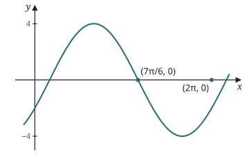

*Figure (t_2223_q6): Redrawn: amplitude 4, falling through (7π/6, 0). The scan also marks the point (2π, 0), and the sign inside the bracket is written over on the scan. The transformed graph g is shown as a scan crop because its period can't be read reliably.*

(a) State the values of $a$ and $c$. **[3]**

The graph of $f(x)$ is then transformed to the graph of $g(x)$ shown below.

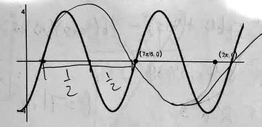

*Figure (t_2223_q6g): The transformed graph g(x), from the scan.*

(b) Write the equation for the graph $g(x) = a\sin(bx + c)$. **[2]**

#### Question 7

The shape $OABC$ is made from a triangle and a sector of a circle. The diagram given is not to scale.

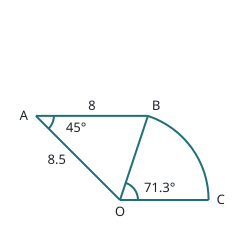

*Figure (t_2223_q7): Redrawn (not to scale, like the original): AB = 8, OA = 8.5, ∠OAB = 45°, ∠BOC = 71.3°, AB ∥ OC.*

Determine the area of sector $OBC$ to three significant figures. **[5]**

#### Question 8

Prove the identity $\tan x + \dfrac{\cos x}{1 + \sin x} = \sec x$. **[5]**

#### Question 9

(a) Prove that $\cos 3x = 4\cos^3 x - 3\cos x$. **[5]**

(b) Write $\sin\!\left(\tfrac{\pi}{2} - x\right)$ in terms of $\cos x$. **[2]**

(c) Verify that $\sin 2x = 4\cos^3 x - 3\cos x$ when $x = \tfrac{\pi}{10}$ radians. **[3]**

(d) Hence determine the exact value of $\sin\!\left(\tfrac{\pi}{10}\right)$. **[8]**

### Trigonometry Test 2023–2024

#### Question 1

Consider the function $f(x) = a\cos(bx)$, with $a, b \in \mathbb{Z}^+$. The following diagram shows part of the graph of $f$.

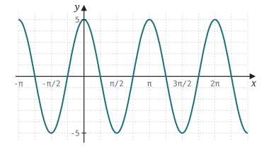

*Figure (t_2324_q1): Redrawn: f(x) = 5 cos 2x (the values a = 5, b = 2 match the scanned graph). x-axis gridlines every π/4.*

(a) Write down the value of $a$. **[1]**

(b) Write down the period of $f$. **[1]**

(c) Hence, find the value of $b$. **[2]**

(d) Find the value of $f\!\left(\tfrac{\pi}{6}\right)$. **[3]**

#### Question 2

The following diagram shows a circle with centre $O$ and radius 4 cm.

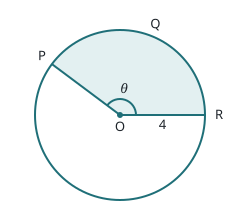

*Figure (t_2324_q2): Redrawn (not to scale): radius 4 cm, arc PQR = 10 cm, sector POR shaded.*

The points $P$, $Q$ and $R$ lie on the circumference of the circle and $\theta$ is measured in radians. The length of arc $PQR$ is 10 cm.

(a) Find the perimeter of the shaded sector. **[2]**

(b) Find $\theta$. **[2]**

(c) Find the area of the shaded sector. **[2]**

#### Question 3

Consider a triangle $ABC$ with $AB = 10$ cm, $BC = 5$ cm, and $\angle ABC = 120^\circ$.

(a) Draw a diagram representing the information above. **[1]**

(b) Find the exact value of $AC$. **[2]**

(c) Find the exact value of the area of triangle $ABC$. **[2]**

(d) Hence, find the shortest distance from $B$ to line $AC$. **[2]**

#### Question 4

In the following triangle $ABC$, $AB = \sqrt{6}$ cm, $AC = 10$ cm and $\cos B\hat{A}C = \tfrac{1}{5}$.

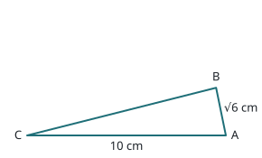

*Figure (t_2324_q4): Redrawn to scale: AB = √6 cm, AC = 10 cm, cos BÂC = 1/5.*

Find the area of triangle $ABC$. **[6]**

#### Question 5

(a) Show that the equation $\cos 2x = \sin x$ can be written in the form $2\sin^2 x + \sin x - 1 = 0$. **[1]**

(b) Hence, solve $\cos 2x = \sin x$, where $-\pi \le x \le \pi$. **[5]**

#### Question 6

Solve $9^{\sin^2 x} + 9^{\cos^2 x} = 6$ for $0 \le x \le \pi$. **[6]**

#### Question 7

Solve $\displaystyle\sum_{n=2}^{\infty} \cos^n x = 1 + \cos x$, where $0 < x < \pi$. **[6]**

#### Question 8

The following diagram represents a large Ferris wheel, with a diameter of 100 metres.

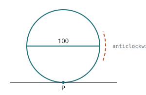

*Figure (t_2324_q8): Redrawn: wheel of diameter 100 m, P starts at the lowest point at ground level.*

Let $P$ be a point on the wheel. The wheel starts with $P$ at the lowest point, at ground level. The wheel rotates at a constant rate, in an anticlockwise direction. One revolution takes 20 minutes.

(a) Write down the height of $P$ above ground level after **[2]**

i. 10 minutes;  ii. 15 minutes.

Let $h(t)$ metres be the height of $P$ above ground level after $t$ minutes. Some values of $h(t)$ are given in the table below.

| $t$ | 0 | 1 | 2 | 3 | 4 | 5 |
|---|---|---|---|---|---|---|
| $h(t)$ | 0.0 | 2.4 | 9.5 | 20.6 | 34.5 | 50.0 |

(b) Determine the values of: i. $h(8)$; ii. $h(21)$. **[4]**

(c) Sketch the graph of $h$, for $0 \le t \le 40$. **[3]**

(d) Given that $h$ can be expressed in the form $h(t) = a\cos bt + c$, find $a$, $b$ and $c$. **[5]**

#### Question 9

Consider an acute angle $\theta$ such that $\cos\theta = \tfrac{2}{3}$.

(a) Find the value of $\sin\theta$. **[2]**

(b) Find the value of $\sin 2\theta$. **[2]**

The following diagram shows triangle $ABC$ with $\angle B = \theta$, $\angle A = 2\theta$, $BC = a$ and $AC = b$.

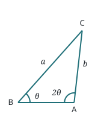

*Figure (t_2324_q9a): Redrawn to scale with cos θ = 2/3: ∠B = θ, ∠A = 2θ, BC = a, AC = b.*

(c) Show that $b = \dfrac{3a}{4}$. **[2]**

$[BA]$ is extended to form an isosceles triangle $DAC$, with $\angle D = \theta$, as shown in the following diagram.

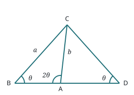

*Figure (t_2324_q9b): Redrawn: [BA] extended to D so that triangle DAC is isosceles with ∠D = θ.*

(d) Find the value of $\sin(C\hat{A}D)$. **[3]**

(e) Find the area of triangle $DAC$, in terms of $a$. **[5]**

### Trigonometry Test 2024–2025

#### Question 1

Determine the following values.

(a) $\cos\!\left(\tfrac{3\pi}{2}\right)$ **[1]**  (b) $\sin\!\left(\tfrac{3\pi}{4}\right)$ **[1]**  (c) $\cos\!\left(-\tfrac{\pi}{3}\right)$ **[2]**

#### Question 2

A sector has a radius of 12 cm and a central angle of $40^\circ$.

(a) Determine the measure of the central angle in radians. **[1]**

(b) Find the area of the sector. **[2]**

(c) Find the perimeter of the sector. **[2]**

#### Question 3

The diagram below shows the graph of $y = f(x)$.

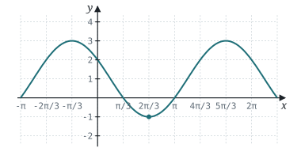

*Figure (t_2425_q3): Redrawn: a sinusoid with maximum 3, minimum −1 and a minimum at x = 2π/3 (the curve the scan shows). x-axis gridlines every π/3.*

If $f(x) = a\cos(x - c) + d$ where $a < 0$, $c > 0$ and $d > 0$, find the values of these constants for the smallest value of $c$. **[4]**

#### Question 4

Solve the equation $2\sin^2 x + 1 = 3\sin x$ for $0 \le x < 2\pi$. **[5]**

#### Question 5

A Ferris wheel has a radius of 9 m and a maximum height of 20 m. The wheel rotates once every two minutes.

(a) A rider gets in at the bottom of the ride. Sketch a graph to represent the height of a rider $h$, above the ground varies with time, $t$, for the first three minutes. **[4]**

(b) Write an equation for the graph that models this scenario. **[3]**

(c) Determine the rider's height after 90 seconds. **[2]**

(d) For how many seconds during each revolution is the rider's height above 11 m? **[2]**

#### Question 6

The diagram below shows $\triangle ABC$ with $AB = 10$ cm, $BC = 5$ cm and $\angle ABC = 120^\circ$. Find the exact values of

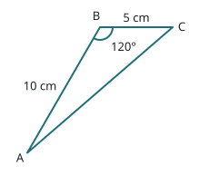

*Figure (t_2425_q6): Redrawn to scale: AB = 10 cm, BC = 5 cm, ∠ABC = 120°.*

(a) length $AC$ **[2]**

(b) the area of $\triangle ABC$. **[2]**

#### Question 7

Prove: $\dfrac{\tan\theta - \sin\theta}{\sec\theta} = \dfrac{\sin^3\theta}{1 + \cos\theta}$. **[5]**

#### Question 8

The water temperature $T$, in degrees Celsius, of an aquarium follows a sinusoidal pattern $T(t) = 24 + 4\sin\!\left(\tfrac{\pi}{6}t\right)$, where $t$ is the number of hours after midnight.

(a) Show that the minimum and maximum temperatures of the aquarium are $20^\circ$C and $28^\circ$C respectively. **[2]**

(b) Determine the specific times in the first 24 hours when the temperature is at its maximum. **[2]**

The population of plankton, $P$, growing in the aquarium is modelled by an exponential function of temperature $P(t) = 200 \times 2^{\frac{T(t) - 24}{2}}$. *(the denominator of the exponent is blurry on the scan; 2 is consistent with part (e)'s "8 hours")*

(c) Evaluate $P(0)$. **[2]**

(d) Find the first two times, $t \in (0, 24]$, at which $P(t) = 200$. **[2]**

In order to introduce fish into the aquarium and keep them well fed, the plankton population must be at least 400 for a minimum of 8 hours per day.

(e) Solve the trigonometric inequality for $0 \le t \le 24$ to find all intervals during which $P(t) \ge 400$. **[4]**

(f) State the total hours in a 24-hour period that the population is at least 400. **[1]**

#### Question 9

(a) Show that $(\sin\theta + \cos\theta)^2 = 1 + \sin 2\theta$. **[3]**

(b) Hence or otherwise, prove $(\sin\theta + \cos\theta)^4 + (\sin\theta - \cos\theta)^4 = 2 + 2\sin^2 2\theta$. **[4]**

(c) Hence, determine the exact maximum and minimum values of $g(\theta) = (\sin\theta + \cos\theta)^4 + (\sin\theta - \cos\theta)^4$ and state the exact values of $\theta$ for $0 \le \theta < \pi$. **[5]**
## Chapter 5 — Probability

### Probability Worksheet
*(the original file includes an answer key — it's reproduced at the end of this section)*

**Section 1**

#### Question 1

At a traffic light, the red light is on for 30 s, amber for 5 s, and green for 45 s. What is the probability of arriving when the light is red?

#### Question 2

A roulette wheel consists of 38 numbers: 1 to 36, 0, and 00. What is the probability that a roulette ball will come to rest on an even number other than 0 or 00?

#### Question 3

A coin showed heads 40 times in 60 tosses.

(a) What is the experimental probability of a head?

(b) What is the theoretical probability of a head?

#### Question 4

A coin showed heads 4 times in a row.

(a) What is the probability of this event?

(b) Is it more likely, less likely, or just as likely for a tail to appear on the next toss as it was on the first toss?

#### Question 5

A card is drawn from a shuffled deck of 52 cards. What is the probability that it is each card?

(a) a red card  (b) a face card  (c) a spade  (d) an ace

**Section 2**

#### Question 1

List the sample space for the toss of a coin and the choice of a random digit from 0 to 9.

#### Question 2

Suppose the probability of precipitation is 0.4. What is its complement? What does it mean?

#### Question 3

An inspector at an egg farm routinely inspects a dozen eggs from each consignment. The inspector records the number of broken eggs as part of the quality control process.

(a) Describe the outcomes in the event "at least 3 eggs are broken".

(b) Describe the outcomes in the event "no more than 2 eggs are broken".

(c) Describe the complement of the event "at most 1 egg is broken".

#### Question 4

Two dice are rolled. Determine the probability of each event.

(a) The difference of the two dice is at least 4.

(b) The sum of the two dice is less than 4.

(c) The difference is at least 4 or the sum is less than 4.

(d) The difference is at least 4 and the sum is less than 4.

(e) The sum is an even number.

(f) The sum is either 6 or 12.

(g) A double is rolled.

(h) The sum is at least 9.

#### Question 5

One card is drawn from a standard deck of 52 cards.

(a) Determine the probability of: i. $A$: getting an ace  ii. $B$: getting a black card  iii. $H$: getting a heart

(b) Determine each probability: i. $P(H')$  ii. $P(A \cup B)$  iii. $P(A \cap H)$  iv. $P(H \cup B)$

#### Question 6

A certain experiment has only 4 outcomes. The probability of each outcome is twice the probability of the preceding outcome. What is the probability of each outcome?

**Section 3**

#### Question 1

In a survey, 42% of households contacted owned a home computer and 13% owned a home entertainment system. Eight percent of all households contacted owned both. What is the probability that a household will own neither?

#### Question 2

A market study found that 50% of a neighbourhood like Japanese food while 60% like Italian food. Thirty percent like both. What is the probability that a resident will like Japanese food but not Italian food?

#### Question 3

A card is drawn from a standard deck of 52 cards. Determine the probability of each event.

(a) The card is a heart or a spade.  (b) The card is an ace or a face card.  (c) The card is a heart or a face card.  (d) The card is an ace or a spade.

#### Question 4

A store advertised a sale in the newspaper and on TV. A survey of 200 customers indicated that 60 learned about the sale from the newspaper, 50 from TV, and 30 from both sources. What is the probability of each event?

(a) A randomly selected customer saw the advertisement in the newspaper and on TV.

(b) A randomly selected customer saw the advertisement in at least one of the two media.

(c) A randomly selected customer saw the advertisement in exactly one form.

#### Question 5

Determine if the following events are dependent or independent.

(a) Drawing a queen from a deck of cards and then drawing another queen, with no replacement.

(b) Drawing a king for the first card and a jack for the second card, with no replacement.

(c) Tossing a coin and getting a head, then rolling a die and getting 3.

(d) Rolling a die and getting 6, then rolling it again and getting 1.

(e) Tossing a coin 10 times and getting a head every time.

(f) Winning at a solitaire game twice in a row.

#### Question 6

Thirty percent of seniors catch the flu every year. Fifty percent of seniors have yearly flu shots. Ten percent of seniors who have had flu shots get the flu. Are getting a flu shot and getting the flu independent events?

#### Question 7

A bag contains 6 white balls and 8 yellow balls. What is the probability of each event?

(a) drawing 3 white balls  (b) drawing 1 yellow ball and 1 white ball

#### Question 8

The first card drawn from a standard deck of 52 cards is a spade. A second card is then drawn without replacing the first. What is the probability that the second card is a spade?

#### Question 9

A biased coin with $P(\text{Heads}) = 0.7$ was tossed 3 times. The coin came up heads first, then tails twice. What is the probability of this outcome?

#### Question 10

Two cards are drawn from a standard deck of 52 cards without replacement. Determine the probability of each event.

(a) The cards are both spades.  (b) Neither card is a spade.  (c) Exactly one of the two cards is a spade.

**Section 4**

#### Question 1

Two cards are drawn without replacement from a shuffled deck of 52 cards. What is the probability that the second card is each card?

(a) an ace  (b) a club  (c) a red card  (d) a red face card  (e) a black jack  (f) the queen of hearts

#### Question 2

There are 100 boys and 120 girls in the grade 12 year. Twenty boys and 30 girls have no siblings. A student is randomly selected.

(a) What is the probability that the student has no siblings?

(b) A student is chosen who has no siblings. What is the probability that the student is a girl?

#### Question 3

One bag contains 4 white balls and 6 black balls. Another bag contains 8 white balls and 2 black balls. A coin is tossed to select a bag, then a ball is randomly selected from that bag.

(a) What is the probability that a white ball will be drawn?

(b) Suppose a white ball was drawn. What is the probability that it came from the first bag?

#### Question 4

A medical test for glaucoma is 95% accurate. Suppose 0.8% of the population have glaucoma. What is the probability of each event?

(a) A randomly selected person will test negative.

(b) A person who tests negative has glaucoma.

(c) A person who tests positive does not have glaucoma.

**Section 5**

#### Question 1

Three balls are randomly drawn from a bag containing 3 white balls and 5 black balls.

(a) How many ways are there to choose the 3 balls?

(b) How many ways are there to choose exactly 2 white balls?

(c) What is the probability that there are exactly 2 white balls?

#### Question 2

Four people are to be randomly selected from a group of 8 boys and 6 girls. What is the probability of each event?

(a) Exactly 3 people will be girls.  (b) All 4 people will be boys.  (c) The four people chosen would alternate in gender.

#### Question 3

Five cards are dealt from a standard deck of 52 cards. What is the probability of each event?

(a) 2 aces and 3 kings  (b) All hearts  (c) All hearts in sequence from 10 to ace  (d) 4 aces  (e) 4 queens and an ace

#### Question 4

In a test, 67% of the students answered item 1 correctly, 53% answered item 2 correctly, and 30% answered both items correctly. What is the probability that on a randomly selected test paper there is the correct answer to at least one of the two items?

#### Question 5

Two people are selected from a group of 6 females and 4 males. What is the probability of each event?

(a) Two females  (b) Two males  (c) One female and one male

**Section 6**

#### Question 1

Assume that the births of a boy and a girl are equally likely. In a family of 3 children, determine the probability of each event.

(a) 3 girls  (b) 2 girls and 1 boy  (c) 1 girl and 2 boys  (d) 3 boys

#### Question 2

Suppose an archer could hit a target 80% of the time. What is the probability that the archer would hit the target 9 times out of 10?

#### Question 3

The Canucks and the Bruins are in the finals, which is a best-of-seven series. The probability of a Canucks win in any game is 80%. What is the probability that the Canucks will win the series in exactly 6 games?

#### Question 4

Jim has scored a goal in 70% of the games he played. What is the probability that he would score a goal in at least 7 of his next 8 games?

#### Question 5

The probability of rain for any day in March is 70%. What is the probability that it will rain at most 5 days in a week in March?

**Answer key (as given in the file — fractional answers were equation images and didn't survive the old .doc format)**

- S2: 1) {H0–H9, T0–T9} · 2) 0.6; probability of no precipitation · 3a) 3 to 12 broken inclusive; b) 0, 1 or 2 broken; c) at least 2 broken · 4d) 0
- S3: 1) 53% · 2) 20% · 5) dep, dep, indep, indep, indep, indep · 6) No · 9) 0.063
- S4: 4a) 94.3% b) 0.0424% c) 86.7%
- S5: 1a) 56 b) 15 · 2a) 0.160 b) 0.070 c) 0.420 · 4) 0.9
- S6: 1) 0.125, 0.375, 0.375, 0.125 · 2) 0.268 · 3) 0.164 · 4) 0.255 · 5) 0.671
